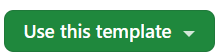

# rpiApp

A cross-platform project template for Windows and Linux, using the MVVM design pattern for easier maintenance and testing.

## Table of Contents
- [Introduction](#introduction)
- [Features](#features)
- [Getting Started](#getting-started)
- [Publishing](#publishing)
- [How to Add a New Content Control](#how-to-add-a-new-content-control)]
- [How to Show a Message Box](#how-to-show-a-message-box)]
- [Debugging](#debugging)
- [Contributing](#contributing)
- [License](#license)

## Introduction
rpiApp is a project template designed to facilitate the development of cross-platform applications for both Windows and Linux. It leverages the Model-View-ViewModel (MVVM) design pattern to ensure that the codebase is maintainable and testable. 

## Features
- [Avalonia](https://avaloniaui.net/?utm_source=nuget&utm_medium=referral&utm_content=project_homepage_link) GUI Framework
- Cross-platform support for Windows and Linux
- [MVVM](https://github.com/CommunityToolkit/dotnet) design pattern
- [Semantic versioning](https://semver.org/spec/v2.0.0-rc.2.html) for version management
- Examples using the following NuGet Packages
	- [Serilog](https://github.com/serilog/serilog) logging
	- [IoT Device Bindings](https://github.com/dotnet/iot) for various IoT boards, chips, displays and PCBs including RPi.
	- [Property Grid](https://github.com/bodong1987/Avalonia.PropertyGrid) for easy editing of a class properties.
	- [MVVM Dialogs](https://github.com/mysteryx93/HanumanInstitute.MvvmDialogs)Library simplifying the concept of opening dialogs and message boxes from a view model when using MVVM
	- [LiveChart2](https://github.com/beto-rodriguez/LiveCharts2) Simple, flexible, interactive & powerful charts, maps and gauges for .Net
	- [Microsoft Extensions Dependency Injection](https://www.nuget.org/packages/Microsoft.Extensions.DependencyInjection/9.0.1#show-readme-container) Supports the dependency injection (DI) software design pattern which is a technique for achieving Inversion of Control (IoC) between classes and their dependencies.
	- [Avalonia Edit](https://github.com/AvaloniaUI/AvaloniaEdit) Text editor with syntax highlighting, code completion, and tons of other features.
## Getting Started

### Prerequisites
- .NET 9 SDK
- Visual Studio 2022 or any other compatible IDE

### Installation
Select []() from GitHub (https://github.com/mrhodel/rpiApp.git) to create a new repository

## Publishing
To publish the application, you can use Visual Studio:

1. Open the project in Visual Studio.
2. Right-click the project in Solution Explorer and select **Publish**.
3. Select a publish profile []()  (Select linux-arm64 for Raspberry Pi)
4. Click Publish.

The published files will be available in the specified folder. You can then distribute these files as needed.
Note: For debugging on Linux do not check "Produce Single File" found in File Publish Options.

## How to Add a New Content Control
### Add the following files
```c#
/*
 * YOURViewModel.cs
 * 1/26/2025 YOU
*/
namespace YOURApp.ViewModels;

public class YOURViewModel : ViewModelBase
{
}
```

```c#
<!--
 YOURView.axaml
 1/26/2025 YOU
-->
<UserControl
    x:Class="YOURAPP.Views.YOURView"
    xmlns="https://github.com/avaloniaui"
    xmlns:x="http://schemas.microsoft.com/winfx/2006/xaml"
    xmlns:d="http://schemas.microsoft.com/expression/blend/2008"
    xmlns:mc="http://schemas.openxmlformats.org/markup-compatibility/2006"
    xmlns:vm="using:YOURApp.ViewModels"
    d:DesignHeight="450"
    d:DesignWidth="800"
    x:DataType="vm:YOURViewModel"
    mc:Ignorable="d">
    
    <Design.DataContext>
        <!--
            this only sets the datacontext for the previewer in an ide,
            to set the actual datacontext for runtime, set the datacontext property in code (look at app.axaml.cs)
        -->
        <vm:YOURViewModel />
    </Design.DataContext>
    
    <grid/>   
</UserControl>
```
Inherit UserControl from your code behind file. Note: This file is created automatically when you add a control to your project.
```c#
using Avalonia.Controls;
namespace YOURApp.Views;

public partial class YOURView : UserControl
{
    public YOURView()
    {
        InitializeComponent();
    }
}
```
### Register your ViewModel in ConfigureServices.cs
```c#
.AddTransient<YOURViewModel>()
```
If you want to show your Content Control as a dialog, add an extension method to DialogExtensions.cs
```c#
    public static async Task<bool?> ShowYOURViewAsync(this IDialogService dialog, INotifyPropertyChanged? ownerViewModel)
    {
        var viewModel = dialog.CreateViewModel<YOURViewModel>();
        var settings = new DialogHostSettings(viewModel)
        {
            DialogMargin = new Avalonia.Thickness(20),
            DisableOpeningAnimation = false,
            CloseOnClickAway = true
        };
        // If the calling view model is for a window then use that window as the owner, otherwise use the main view.
        Guard.IsNotNull(_mainView);
        await dialog.ShowDialogHostAsync((ownerViewModel is not null) ? ownerViewModel : _mainView, settings);
        return viewModel.DialogResult;
    }
```
### Add this code in your View Model to show the dialog:
```c#
        var result = await _dialogService.ShowCameraInfoViewAsync(null);
        Debug.WriteLine($"Dialog result: {result}");
```
## How to Show a Message Box
```c#
        var result = await _dialogService!.ShowMessageBoxAsync(
                null,
                "Not implemented", "",
                MessageBoxButton.Ok,
                MessageBoxImage.Warning,
                null);
        Debug.WriteLine($"Dialog result: {result}");
```


## Debugging

### Remote Debugging a Linux Target

1. Copy the published files to the target system. I recommend [WinSCP](//winscp.net/) to sync your local publish folder with the remote device.
2. Run the application on the remote device.
3. Select **Attach to Process...** from the Visual Studio Debug menu.
4. Enter the Connection type and connection target.
5. Select the application from the list, and click connect.


[]()

### On Windows use Visual Studio as usual.

## Contributing
Contributions are welcome! Please fork the repository and submit a pull request with your changes. Ensure that your code adheres to the existing coding style and includes appropriate tests.

## License
This project is licensed under the MIT License. See the [LICENSE](LICENSE) file for more details.
